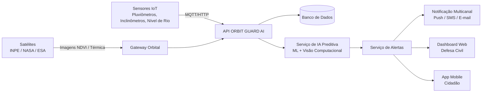
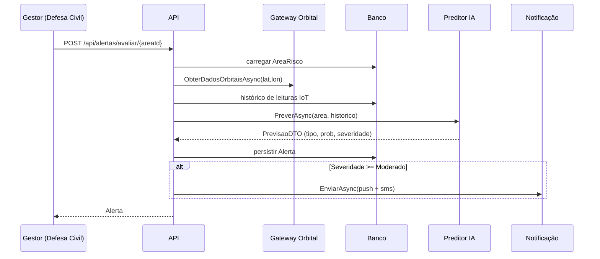
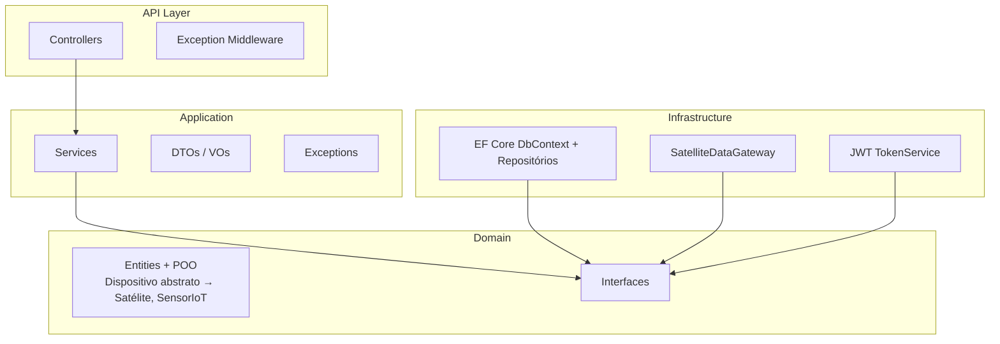

# Diagrama de Fluxos — ORBIT GUARD AI

## 1. Fluxo de Dados (alto nível)

```mermaid
flowchart LR
    SAT[Satélites
INPE / NASA / ESA] -- Imagens NDVI / Térmica --> GW[Gateway Orbital]
    IOT[Sensores IoT
Pluviômetros, Inclinômetros, Nível de Rio] -- MQTT/HTTP --> API[API ORBIT GUARD AI]
    GW --> API
    API --> DB[(Banco de Dados)]
    API --> AI[Serviço de IA Preditiva
ML + Visão Computacional]
    AI --> ALERT[Serviço de Alertas]
    ALERT --> NOTIF[Notificação Multicanal
Push / SMS / E-mail]
    ALERT --> DASH[Dashboard Web
Defesa Civil]
    ALERT --> APP[App Mobile
Cidadão]
```

## 2. Fluxo de Geração de Alerta

```mermaid
sequenceDiagram
    participant G as Gestor (Defesa Civil)
    participant API as API
    participant GW as Gateway Orbital
    participant DB as Banco
    participant IA as Preditor IA
    participant N as Notificação

    G->>API: POST /api/alertas/avaliar/{areaId}
    API->>DB: carregar AreaRisco
    API->>GW: ObterDadosOrbitaisAsync(lat,lon)
    API->>DB: histórico de leituras IoT
    API->>IA: PreverAsync(area, historico)
    IA-->>API: PrevisaoDTO (tipo, prob, severidade)
    API->>DB: persistir Alerta
    alt Severidade >= Moderado
        API->>N: EnviarAsync(push + sms)
    end
    API-->>G: Alerta
```

## 3. Camadas

```mermaid
flowchart TB
    subgraph API[API Layer]
      C[Controllers]
      MW[Exception Middleware]
    end
    subgraph APP[Application]
      SVC[Services]
      DTO[DTOs / VOs]
      EX[Exceptions]
    end
    subgraph DOM[Domain]
      E[Entities + POO
Dispositivo abstrato → Satélite, SensorIoT]
      I[Interfaces]
    end
    subgraph INF[Infrastructure]
      DATA[EF Core DbContext + Repositórios]
      AUTH[JWT TokenService]
      EXT[SatelliteDataGateway]
    end
    C --> SVC
    SVC --> I
    DATA --> I
    EXT --> I
    AUTH --> I
```